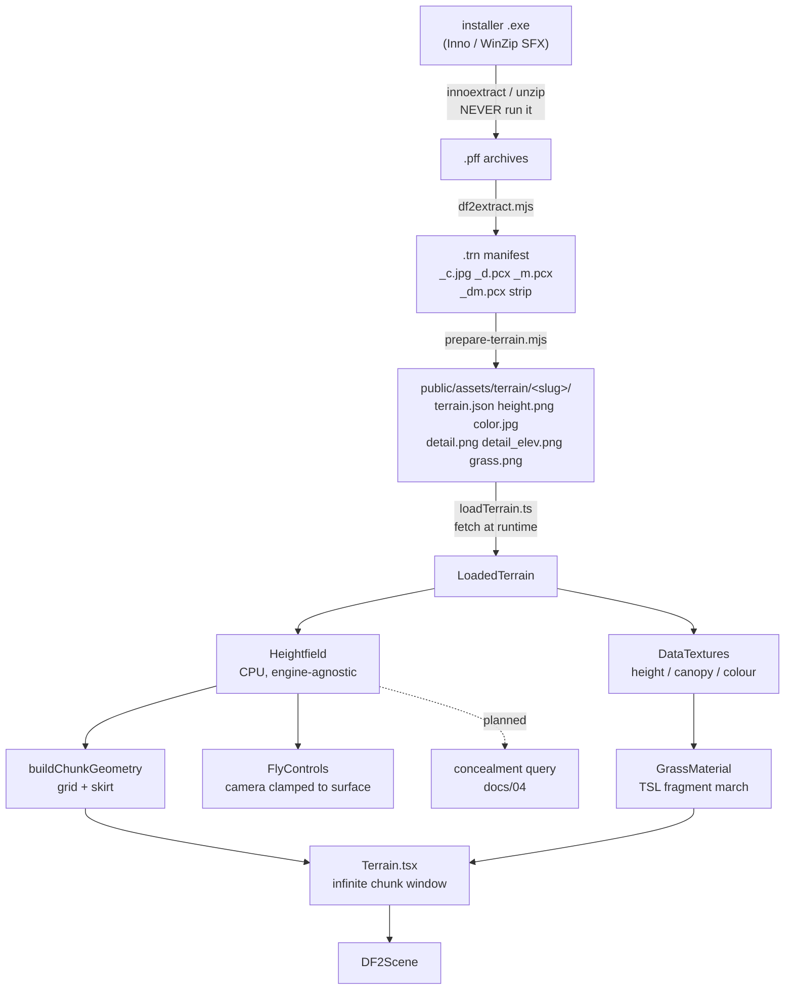

# Implementation Spec — as-built

**Audience:** anyone (human or agent) picking this codebase up cold.

Docs `01`–`05` describe what we intend to build. `06` and `07` record what we learned from
real data and real measurement. **This document describes what the code actually does today**,
the contracts between its parts, and the traps that have already cost sessions.

Where this document and `01`–`05` disagree, this one describes reality and `01`–`05` describe
the target. Where this document and `06`/`07` disagree, **`06`/`07` win** — they are ground
truth from extracted data and measurement, and this file is a summary that can drift.

`00-core-design-thesis.md` is a different kind of document from all of these: it is the *why*.
Nothing here overrides it. When a decision is a judgement call rather than a fact — and most
of the interesting ones are — the pillars decide, and the test is **"would a veteran DF2
player instinctively recognise this?"** The appendix to `00` maps the pillars onto the
decisions in this file that already depend on them.

---

## 1. What exists

A browser reconstruction of Delta Force 2's Voxel Space 32 terrain and its concealing tall
grass. Runs on Three.js `WebGPURenderer` with TSL shaders, auto-falling back to WebGL2.

Two data paths, one code path:

- **Real map.** If `public/assets/terrain/<slug>/terrain.json` exists it renders that
  extracted DF-era terrain. Currently `gmile` = EXP2b "Green Mile".
- **Synthetic.** Otherwise a periodic fBm heightfield. Needs no game assets, so the repo
  clones and runs for anyone.

Both tile **infinitely** — DF2 terrain has no edges (`06` §10).

### Phase status

| | |
| --- | --- |
| Phase 0 — extraction | core done: PFF3 unpack, `.trn` parse, PCX decode, canopy bake |
| Phase 1 — terrain | done: chunked LOD, skirts, analytic normals, TSL biome material, infinite tiling |
| Phase 1.5 — real map | done: Green Mile renders from extracted assets |
| Phase 2 — grass | columnar fragment march, bracket-and-bisect. **60 fps target met** — 8.3 ms standing AND prone at Green Mile with the canopy forced on, both vsync-capped, so true cost is lower and unknown. Prone/crouch concealment now works (`07` §9). Open: crest layering, near-field blockiness, ridgeline floating grass, and the canopy field being ankle height (`06` §7.1) |
| Phase 3 — concealment | demonstrated in the test rig (`07` §8), not yet a gameplay system |
| Phase 4 — game | not started |

---

## 2. Data flow



The dashed edge is the point of the whole architecture: the **same** CPU field that shapes the
mesh will answer line-of-sight queries, so what you see and what the game thinks you can see
cannot drift apart (`04` §2).

---

## 3. Module map

Everything below `src/df2/` is the Phase-1 spike. The target layout is `05` §7
(`/src/engine/{terrain,grass,concealment}`, `/src/game/`); nothing has moved yet.

| File | Owns | Must NOT know about |
| --- | --- | --- |
| `config.ts` | every world constant | anything |
| `noise.ts` | deterministic value noise + fBm | — |
| `Heightfield.ts` | CPU elevation field: `sample()`, `normal()` | **Three.js** — keep it import-free of the renderer |
| `terrainGeometry.ts` | one chunk's `BufferGeometry` (grid + skirt) | chunk placement, LOD policy |
| `TerrainMaterial.ts` | TSL colormap / biome material | geometry |
| `GrassMaterial.ts` | TSL columnar grass (march + depth) | geometry, chunk layout |
| `loadTerrain.ts` | fetch + decode prepared assets, grass provenance | rendering |
| `Terrain.tsx` | infinite chunk window, LOD selection, geometry cache | what a chunk looks like |
| `FlyControls.tsx` | camera rig, stance eye heights | scene contents |
| `PerfMonitor.tsx` | frame time, draw calls, backend | UI |
| `DF2Scene.tsx` | composition: lights, fog, water, wiring | UI layout |
| `components/GameCanvas.tsx` | async WebGPU init, camera planes | the scene |
| `components/Hud.tsx` | all UI | rendering internals |
| `grassJitter.ts` | CPU bake of the per-column jitter/tone field | rendering |
| `heightTexture.ts` | elevation texture + **point-decimated** mip chain matching the mesh's LOD lattice | chunk placement |
| `bench.ts` | `?bench=1` URL overrides, `window.__perf` | anything gameplay |
| `components/GrassDebug.tsx` | live grass sliders; writes `uniform.value` directly | material internals |
| `fps/WeaponPrototype.tsx` | first-person rig, weapon animation | terrain, grass |
| `fps/ScopeRig.tsx` | picture-in-picture optic, reticles | terrain, grass |
| `fps/TestTargets.tsx` | human-scale contrast ladder, `?targets=1` | anything but the heightfield |

`Heightfield.ts` being Three-free is a **rule, not a preference**. It is the seed of the
gameplay field, which must be samplable on a server with no renderer present.

---

## 4. Conventions that are easy to get wrong

These have each caused a real bug.

**Axes.** Right-handed, Y up. `x` = east, `z` = north in the HUD's language. Image row 0 is
the map's **north** edge.

**Colormap `flipY = false`.** The heightmap is read row-major with row 0 north; if the
colormap flips, relief and colour mirror against each other. Subtle enough to survive a
glance, obvious once you look at a ridge shadow.

**All terrain textures use `RepeatWrapping`.** UVs run past `[0,1]` because the map tiles;
clamping smears edge pixels across the world.

**UV = wrapped world position over one tile**, computed in `terrainGeometry.ts` as
`(worldX + halfWorld) / worldSize`. This is why one cached geometry is valid at every tile
repeat.

**The heightfield stores exactly `period × period` samples.** No duplicated edge row, no
clamping — `sample()` wraps modulo. A duplicated edge row would make the tile seam visible as
a flat strip.

**`worldSize = period × cellSize`**, i.e. 1024 × 2.0 = **2048 m** for the real map — not
`1023 × cellSize`. The "1023" reading belongs to a clamped field with a duplicated edge; this
field wraps.

**Canopy texture is LINEAR-filtered, deliberately.** It is the canopy *envelope* (where grass
grows, roughly how tall), not the columns. Per-column discreteness comes from the shader's
sub-metre cell grid. Sampling the envelope NEAREST stamps the 2 m terrain texel grid onto the
canopy as visible blocks.

**Shaders are authored in TSL, never raw WGSL/GLSL.** One graph has to serve both the WebGPU
and WebGL2 backends.

**Assets are committed — raw and prepared both.** `/assets/` holds the source archives
(`EXP2.PFF`, `.trn` manifests, PCX/JPEG/TGA — see `assets/README.md`) and
`public/assets/terrain/<slug>/` the prepared output, so the pipeline reproduces from source and
a Git-connected build renders the real map. Community mod freeware authored by this project's own mod team, who hold the rights. The
distinction that still holds: **retail**-extracted DF2 data is personal-use-only and does not
get committed or shipped (`01` §3).

**Never execute an installer.** `innoextract` / `unzip` unpack them statically. No Wine, no
Whisky, no "just run it in a VM".

---

## 5. Asset pipeline contract

### 5.1 Producing assets

```sh
node tools/df2-extract/df2extract.mjs list    terrain.pff
node tools/df2-extract/df2extract.mjs extract terrain.pff out/terrain
node tools/df2-extract/df2extract.mjs trn     out/terrain/Something.trn

node tools/df2-extract/prepare-terrain.mjs <extractedDir> <trnName> <outDir> \
     [--detail-elev <strip.pcx>]
```

`prepare-terrain.mjs` writes `<outDir>/terrain.json` plus the PNG/JPEG assets. Point `<outDir>`
at `public/assets/terrain/<slug>/`, and set `TERRAIN_SLUG` in `config.ts`.

### 5.2 `terrain.json` — the contract between tool and runtime

Consumed by `loadTerrain.ts`; its TypeScript shape is `TerrainMeta` there.

- `trn` — the parsed manifest verbatim: `terrain_name`, `terrain_creator`, `water_height`,
  `filter` (RGB tint, 128 = neutral), `detail_elev` (**the name it references**), etc.
- `assets.height` — `{ file, width, height, rawMin, rawMax }`. 8-bit greyscale PNG.
- `assets.color` — the colormap, JPEG passthrough.
- `assets.detail` — per-texel zoning **indices** 0–255 as greyscale.
- `assets.detailElev` — the strip. Carries `substituted`, `substitutedFrom`, `referencedName`.
- `assets.grass` — the baked canopy field, and **`substituted`** if it was baked from a
  strip that isn't the one the `.trn` asked for.

### 5.3 The grass chain, and why provenance is tracked

```
detail_map[x,z]  ->  index 0-255
index            ->  tile i of the detail_elev strip (64 x 16384 = 256 tiles of 64x64)
tile greyscale   ->  grass STRETCH HEIGHT
                 ->  baked to grassHeightField
```

The renderer **and** the concealment query both read that one baked field. That sharing is the
entire point (`04` §2).

The index numbering is **per grass set**, not per terrain. Green Mile's `.trn` names
`detail_elev = dfdg1_dm`, a base-game set that is not in any archive we have (`06` §7 lists it
as still-needed, along with the five marquee grass maps that reference it). Substituting a
different terrain's strip means index 37 selects *some other set's* tile 37 — grass ends up
tall where the map should be bare and bare where it should be chest-high. Plausible-looking and
wrong, which is the worst failure mode for a project whose success metric is grass.

So `loadTerrain.ts` implements a provenance ladder and **refuses** the substituted bake:

| `GrassSource` | When | Trustworthy? |
| --- | --- | --- |
| `"real"` | the `.trn`'s own strip was present | yes |
| `"substituted-strip"` | reserved; currently never selected | no |
| `"colormap-standin"` | strip substituted or absent → canopy derived from colormap greenness + per-column jitter | **placement invented** |
| `"none"` | no colormap either | — |

The HUD renders `colormap-standin` in warn colour and names it "stand-in (not real)". Anything
that reports grass results must state which of these it ran against.

**What Green Mile's current build is honest about:** heightmap, colormap, water height and
filter are genuinely Green Mile. Only canopy placement and height are invented. Column shape,
density, tone variation and the *geometry* of concealment are fair to judge; whether grass
grows in the right places is not.

---

## 6. Runtime contracts

### 6.1 `Heightfield`

```ts
Heightfield.synthetic(seed?)                 // periodic fBm, no assets
Heightfield.fromHeightmap({ data, size, metersPerTexel?, heightScale? })
  .sample(x, z): number                      // bilinear, wraps
  .normal(x, z, out?): [number, number, number]  // central differences, wraps
  .period .cellSize .worldSize .halfWorld .minHeight .maxHeight .isReal
```

Normals come from the **field gradient**, not from triangles, so shading is identical across
LOD levels (`03` §2.4). `normal()` writes into a caller-supplied array — it is called per
vertex during meshing and must not allocate.

### 6.2 Chunking, LOD, and the infinite window (`Terrain.tsx`)

- `chunkSize = worldSize / CHUNK_COUNT` → 2048 / 8 = **256 m**.
- A window of `(2·VIEW_RADIUS_CHUNKS + 1)²` = 19² = **361 slots** is allocated once and
  re-pointed as the camera moves. Nothing is allocated per frame.
- Chunk indices are **absolute and unbounded** (they go negative). Geometry is cached by the
  **wrapped** index `(cx mod 8, cz mod 8, lod)` — chunk `(cx)` and `(cx + period)` are the same
  shape, so every repeat on screen shares one geometry.
- Geometry is built in **local space** (`0..size`) and placed with `mesh.position`.
- LOD is chosen per chunk from the distance to its **centre**, against `LOD_DISTANCE_CHUNKS`
  expressed in chunk widths so it scales with the map.
- `LOD_SEGMENTS[0] = 128` over a 256 m chunk = 2 m vertex spacing, which matches
  `METERS_PER_TEXEL` exactly. LOD0 is lossless.
- Each chunk carries a perimeter **skirt** — edge vertices duplicated `SKIRT_DEPTH` (12 m)
  lower — to plug cracks between differing-LOD neighbours. The material is `DoubleSide` so
  skirt winding does not matter. **See §9: skirts are currently visible as a black band at eye
  height.**

### 6.3 `TerrainMaterial`

`MeshStandardNodeMaterial`, so it keeps PBR response to sun, hemisphere fill and fog for free.
Real map → colormap sample, optionally multiplied by the `.trn` `filter` tint. Synthetic →
procedural biome blend by height and slope.

**The colormap is pre-shaded** (`06` §6): lighting and shadow are baked into the source data.
Dark blotches in a render are usually the data, not the shader — verified at IoU 0.95 with and
without grass (`07` §9). Do not "fix" them without deciding you want to fight the baked
lighting, which is an art decision, not a bug fix.

### 6.4 `GrassMaterial` — the columnar march

The most intricate part of the codebase. Read `07` §1 and §6 before changing it.

**Model.** DF2's grass is not blades. Voxel Space painted, per screen column, a solid vertical
span from the ground to `terrain + stretch`, coloured from that column's own ground texel. The
look is hard-edged vertical striations at total coverage that never thins with distance.

**Implementation.** Render a *shell* — the terrain chunk geometry lifted to the canopy top —
and per fragment march the view ray down through the volume between shell and ground. First
column whose span the ray crosses wins; no hit → discard, and the terrain shows through.

Key decisions, each of which has a failure mode behind it:

| Decision | Why |
| --- | --- |
| Shell lifted by **local** canopy (`× 1.04`), not global max | a globally-lifted shell overhangs ridge silhouettes and shades floating grass |
| Ray starts at the **camera** when `inside` the canopy, else at the fragment | standing in grass the shell is above the eye; marching from the fragment renders no near grass at all |
| `nearClip` offset when inside | at 2 cm range every pixel hits the same column and the screen goes flat |
| Step `= max(cellSize, t · pixelAngle)` | mirrors the original's growing `deltaz`; keeps each step ≈ one pixel |
| `pixelAngle` derived from `cameraProjectionMatrix[1][1]` and `screenSize.y` | a **scope** narrowing FOV automatically tightens the march. Sub-pixel-ness depends on FOV, not range, and ~800 m is exactly where the concealment mechanic is defined |
| One `Fn` returning a **TSL `struct`** `{rgb, hit, depth}` | the march is expensive; separate functions would re-march per output. A TSL function returns a single node, hence the struct |
| `material.depthNode` = depth at the **hit**, not the shell | the shell floats a canopy-height above ground; uncorrected, anything standing *in* the grass pops in front of it. This is the real integration hurdle for GPU Voxel Space ports — not raw speed |
| Colour sampled at the hit column's **texel centre** | reproduces the original's NEAREST `map.color[mapoffset]` lookup without a second texture |
| One colour smeared up the whole column | per-step colour reads as soft modern grass, not DF2 grass |
| Cell indices **wrapped to [0,512)** before the sin-hash | float32 `sin(x·127.1)` degenerates past ~50 000, so finer columns produced *less* variation until this was fixed |
| Multi-scale value noise (`clump`), not white noise | per-cell hashing gives autocorrelation ~0.3 against a reference ~0.8 — television static, not grass |
| **Unlit** `MeshBasicNodeMaterial` | the colormap is already pre-shaded; PBR double-shades it and collapses to black at silhouettes |
| `alphaTest = 0.5`, `transparent = false` | grass is opaque where it exists; keeps it in the opaque queue with correct depth |
| `DoubleSide`, and **no** `normalNode` override | inside the canopy we see the shell from underneath; overriding `normalNode` shades every back face black |

Debug modes: `debugHit` paints hits flat magenta (**use this to mask measurements to grass
pixels**); `debugDistance` encodes ray distance as colour, banded every 100 m.

### 6.5 Camera (`FlyControls.tsx`)

Free-fly (WASD, drag look, wheel = speed) plus an on-foot mode clamped to the surface at a
stance eye height. Orbit controls were removed: judging terrain means standing in it.

```ts
STANCE_EYE = { stand: 1.7, crouch: 0.95, prone: 0.35 }   // metres, matches docs/04 §4.2
```

- `dt` is clamped to 0.1 s/frame. **On a slow machine this throttles movement**, which makes
  scripted camera driving unreliable — see §10.
- Stance keys `X`/`C`/`Z` imply going to ground; stance is not a second click.
- Reports `FlyState` on a ~0.15 s throttle, so the HUD does not re-render per frame.

### 6.6 `PerfMonitor`

Reports fps, mean and worst frame time, draw calls, triangles, and **which backend actually
initialised**. That last field matters: a "it's slow" report means something completely
different on the WebGL2 fallback.

**Gotcha worth knowing.** Three's WebGPU path calls `info.reset()` at the **top of its rAF
callback**, before R3F runs frame subscribers — so reading `gl.info.render` from `useFrame`
always yields zeroes. `PerfMonitor` sets `info.autoReset = false` and resets after sampling.
Anything else reading `info` per frame needs the same treatment.

---

## 7. Constants and their calibration status

`src/df2/config.ts` is the single place world constants live. Status matters more than value:

| Constant | Value | Status |
| --- | --- | --- |
| `METERS_PER_TEXEL` | 2.0 | **PLACEHOLDER — uncalibrated.** Sets world size to 2048 m |
| `HEIGHT_SCALE` | 1.0 | **PLACEHOLDER — uncalibrated.** Metres per raw elevation unit. Now doubly load-bearing: it is what makes one raw unit a 26.6° facet, which is why `HEIGHT_SMOOTH_PASSES` exists |
| `HEIGHT_SMOOTH_PASSES` | 2 | reconstructs relief lost to 8-bit quantisation (`07` §9). **Coupled to `HEIGHT_SCALE`** — re-derive when that is calibrated; 0 restores the raw surface |
| `GRASS_SCALE` | 0.0047 | derived from reference screenshots (`07` §2): tallest canopy ≈ 1.2 m |
| `GRASS_CELL` | 0.03 | measured against the references; slider floor is now 0.002 |
| `GRASS_TONE_VARIATION` | 1.5 | set by eye after the field gained real contrast (`07` §9) |
| `GRASS_SHADE_BASE` | 0.78 | base-to-tip ramp, centred on 1.0. h/v ≈ 1.9 against the references' ~1.6 |
| `GRASS_STRAND_MIX` | 0.35 | per-strand height from the ALU hash vs the texture. **The only visual dial with real frame cost** — height is evaluated per march sample, tone once at the hit |
| `GRASS_STRAND_JITTER` | 0.18 | bake-time share of the height field carried by per-texel noise |
| `GRASS_STEPS` | 32 | **compiled ceiling only.** `?steps=` raises it; the slider sweeps up to it |
| `GRASS_STEPS_RUN` | 12 | what actually runs. Was 96 — a stale unit from the pre-bracket march, costing 8x (`09` §3.1.0) |
| `GRASS_MAX_SPAN` | 28 | lowered from 48 for the crest layering. **Trades reach, and touches invariant 6** — see `09` §3.1 and the DDA addendum |
| `GRASS_NEAR_CLIP` | 1.2 | a REQUEST, not a hard floor — capped at half the ray's slab crossing, or it starts the march past the ground and blanks the near field prone (§8 invariant 6) |
| `insideSpan` | 12 | reach for a ray starting inside the canopy. Earned nothing on frame time; kept because such a ray genuinely needs no more, and it tightens sample spacing |
| `CAP_DISTANCE` | 0.2 m | `Terrain.tsx`. How far ahead of the camera the cap sits; only has to clear `CAMERA_NEAR` |
| `GRASS_FADE_START/END` | 700 / 1100 | scaled by zoom in-shader |
| `CHUNK_COUNT` | 8 | → 256 m chunks |
| `VIEW_RADIUS_MAX_CHUNKS` | 12 | derived per-frame from `FOG_FAR`, capped here |
| `SKIRT_DEPTH` | 12 m | never validated against real LOD error |
| `FOG_NEAR` / `FOG_FAR` | 300 / 2200 m | linear fog. Applied **inside `GrassMaterial`** from the hit distance, not by three from the shell — `material.fog = false`. **Also the tiling-repetition lever** |

Until the two placeholders are calibrated, **"does this feel like DF2?" cannot be answered
honestly.** That is the top of the roadmap, not the grass.

**Every metre-valued constant here is coupled to that calibration and must be re-derived
together, not one at a time.** `METERS_PER_TEXEL` sets world size, which sets `chunkSize`,
which is what `LOD_DISTANCE_CHUNKS` is expressed in; fog, grass fade and the view radius are
all absolute metres and will land in different places relative to the terrain once the scale
moves. Changing one in isolation will look like an improvement and be a regression somewhere
else. Sanity anchors when you do it: the ~800 m concealment range (`00` Pillars 1 and 6), and
grass fade staying inside terrain draw distance (§8 invariant 1).

**Fog is also the accepted answer to tiling repetition** (`00` appendix, decided). The terrain
repeats every 2048 m; if that ever reads as pattern rather than landscape, tighten `FOG_FAR`
rather than trying to defeat the tiling. Do not spend effort on it pre-emptively.

The grass material's uniforms are exposed on the returned `uniforms` object and written
live by the `?debug=1` panel, so most calibration needs no graph rebuild. Two things still
do: the compiled step ceiling (`?steps=`) and the bisection count (`?refine=`).

`CANOPY_MARGIN` (exported from `GrassMaterial.ts`) is the 1.04 shell lift. It is read in two
places that must agree — the vertex lift, and `Terrain.tsx`'s inside-canopy test that decides
whether the grass cap is drawn. Do not re-inline it as a literal.

### The two grass proxies, and why there are exactly two

The march only runs where something rasterises a fragment, and the entry distance depends on
whether the ray was already inside the volume.

| Proxy | Geometry | Entry | Drawn when |
|---|---|---|---|
| **ceiling** | terrain lifted to local canopy, chunk LOD, **FrontSide** | the fragment | always, within the grass radius |
| **cap** | one quad on the camera (`CAP_DISTANCE` = 0.2 m) | the near clip | only while the eye is inside the canopy |

Front faces only on the ceiling is load-bearing, not an optimisation. Its underside is where a
ray LEAVES the volume, and treating that as an entry is what made prone read hits at 120-300 m.
The cap owns that case, with **one fragment per pixel** — which is the whole point. The floor
proxy it replaced answered the same case per chunk, so one pixel marched several times over
(33.3 ms vs 8.5 ms).

The cap is a **rasterisation trigger, not something visible.** It has no appearance of its own;
coverage, gaps and how far you see through the canopy are all still decided per pixel by the
march. It lives in the terrain group and is moved onto the camera each frame — NOT parented to
the camera, because R3F's camera is not in the scene graph and a child of it never draws.

**They are not strictly exclusive, and the gap is bigger than it sounds.** "Drawn when the eye
is inside the canopy" means the map-GLOBAL `canopyMax`: `Terrain.tsx` has the terrain
heightfield but not the canopy field, so it cannot know the LOCAL height and errs toward
drawing. Wherever local canopy < eye < global max, the eye is above the local ceiling, that
ceiling is front-facing, and BOTH proxies march the pixel. With Green Mile's 0.13 m median
against a 1.199 m maximum (`06` §7.1) that is most of the map at crouch and prone. The picture
stays right — the cap searches the near interval and wins the depth test — but the second march
is real and **has not been measured**; both numbers in `09` §0 are at the vsync cap, which is
where a cost like this hides. `?grasscap=0` at a crouched pose on the real canopy is the A/B.

`heightTexture.ts` builds the elevation texture with a point-decimated mip chain so the march
can follow the surface the mesh drew. See §11's "three surfaces" trap.

---

## 8. Invariants that break silently

Nothing throws when these break. Check them after touching `config.ts`.

1. **Terrain must be drawn at least as far as grass is rendered.** Otherwise the march finds
   columns standing on terrain that was never drawn. Currently 2304 m vs a 1100 m grass fade —
   holds, but a change to `VIEW_RADIUS_CHUNKS`, `CHUNK_COUNT` or `GRASS_FADE_END` can break it
   without any error.
2. **`LOD_SEGMENTS[0]` spacing should equal `METERS_PER_TEXEL`** so LOD0 is lossless. Changing
   `CHUNK_COUNT` or `METERS_PER_TEXEL` breaks this pairing.
3. **The canopy field the shader reads and the field a concealment query reads must be the same
   data.** The moment they diverge, what you see and what the game thinks you can see disagree
   — and that *is* the product.
4. **`GRASS_SCALE × 255` should stay below standing eye height (1.7 m).** Above it the camera
   is permanently inside the canopy while standing.
5. **Grass results must be reported with their `GrassSource`.** A number measured against a
   `colormap-standin` canopy says nothing about placement.
6. **The renderer must never conceal LESS than `grassHeightField` says it does.** This is the
   one invariant with a competitive-fairness edge, so it outranks frame time. Concealment is
   queried analytically against the field (`04` §2), so a target prone in distant grass counts
   as concealed no matter what the screen draws. Any rendering limit that silently drops distant
   grass therefore hands the player who triggers it free vision of concealed targets — and the
   cheapest way to trigger it is to go prone, which is also the strongest position. Three limits
   have already done exactly this:
   - `sEnter = inside ? nearClip : fragDistance` with `hitS <= sEnter + span` and
     `span <= GRASS_MAX_SPAN` put a hard 49 m ceiling on every hit on screen the moment the eye
     entered the canopy. Fixed by computing the entry per fragment and searching a near interval
     then a far one (`07` §9).
   - The lifted shell had no floor, so nothing below the horizon was marched at all (`07` §9).
   - **`GRASS_NEAR_CLIP` as a flat floor on the march start.** A floor-proxy fragment's own
     ground point is `fragDist` away, so its ray is inside the slab over
     `[fragDist - span, fragDist]` and nowhere else. Clamping the start up to a flat 1.2 m put
     the WHOLE interval underground whenever the ground was nearer than that: the first sample
     tested below-terrain and broke, so the fragment missed regardless of the grass standing
     there. Prone at 0.35 m AGL every ray steeper than ~16 degrees crosses the ground inside
     1.2 m, so this was a solid bare band across the near field — fairness-INVERTED, since prone
     in grass you could see bare ground where the field counts a target concealed, the exact
     opposite of "concealed means blind" (§11). Fixed by capping the clip at the midpoint of the
     slab crossing, so half the interval is always searched and the clip still applies in full at
     any normal range.

     Found exactly the way this section prescribes, and worth noting as method: the hit mask
     prone, with `?canopyall=1` forcing the canopy on. The band survived full canopy unchanged,
     which is what separated "the march is broken here" from "no grass grows here" — on Green
     Mile's patchy stand-in canopy those two look identical in a normal render.
   - **Taking the ceiling fragment as the ENTRY when the ray started inside the volume.** Prone
     or crouched the eye is already in the canopy, so the ceiling fragment the ray reaches is
     where it LEAVES through the roof — hundreds of metres away for a near-level ray. The march
     therefore began at the exit and never tested the grass around the player's head. Measured:
     the hit-distance view read 120-300 m across the upper frame. Fixed by the cap (§7).

   **THE PATTERN, which is the useful part.** Every one of these is the same mistake wearing a
   different hat: **the march looking at the wrong place along the ray.** Not a sampling problem,
   not a canopy problem, not a reach problem — an ENTRY problem. Four separate bugs this session
   reduced to it. When grass is missing, establish *where the march is looking* before anything
   else; the hit-distance view answers that directly and none of the others do.

   The corollary is that the entry rule accumulated a special case per discovery, each keyed on
   something different — the camera, the proxy, the facing. That is why it kept being wrong. It
   is now two rules: outside the volume you enter at the fragment, inside it you enter at the eye
   and the cap is what tells you which you are.

   **`GRASS_FADE_END` is the remaining one and it is a live design question, not a bug.** Beyond
   it no shell is drawn, so a target prone in grass at 1200 m stands on bare colormap while the
   field still counts them concealed. Concealment is specified at 800 m (`00`, `04`), so the
   current 1100 m covers the spec with room to spare — but the gap is real above that and the
   honest options are to extend the draw distance or to bound the query by it. Do not "fix" this
   by shortening the fade: that widens the gap.

   **Test it, do not assume it.** Any change to the march bounds, the proxy geometry, or the fade
   needs the hit-distance view (`?debug=1`, view 2) checked prone as well as standing. A ceiling
   on hit distance is invisible in a normal render — it looks like ordinary bare ground.

---

## 9. Known-open defects

Full evidence in `07` §9. Summary, so nobody re-derives it.

**Horizontal layering / crest rolling — OPEN, cause understood.**
Grass reads as stacked horizontal slabs rather than stretched vertical columns, worst walking
toward a crest. The geometry IS vertical; the artifact is which surface the ray lands on. With
coarse stepping the ray passes over the near column's vertical FACE and first registers
"below top" above a further column, so the hit resolves on a horizontal TOP face. Bisection
cannot recover it — it refines inside an already-wrong interval. Only more coarse samples or a
shorter span help, and both have been traded against. **The structural fix is DDA cell
traversal** (Amanatides-Woo) bounded by an analytic exit: it cannot step over a column, so it
always finds the true nearest vertical face — which is also how Voxel Space did it. `09` §3.1
already specifies the analytic exit half; only the entry was ever built.

**Crouch and prone NOT BEING BLINDED — CLOSED.** The eye inside the canopy saw straight to
the horizon, and forcing the canopy to full height everywhere changed nothing. It was never a
canopy-height problem and never a missing-fragment problem: the ceiling fragment a ray reaches
from inside the volume is where it **leaves** through the roof, and the entry rule took that as
where it *entered*, so the march started at the exit. Hit-distance view prone read 120-300 m
across the upper frame — the grass being drawn was grass hundreds of metres away while the
canopy around the player's head was stepped straight over. Fixed by the cap (§7).

**Near-field grass is blocky — OPEN.**
Up close a column is a large flat rectangle: `GRASS_CELL` is a fixed 0.03 m in WORLD space, so
it is correct at range and enormous at arm's length (~22 px at 1.2 m, ~90 px at 0.3 m). One
colour per column is deliberate and right — it is what makes striations — but at that size it
reads as tiling. DF2 dodged this by construction, drawing one column per SCREEN column, so its
columns were always a pixel wide. Two candidate fixes: make the cell size track the pixel
footprint (quantised to powers of two so columns stay world-anchored and do not swim), or hand
the near field to the `03` §4 instanced-geometry layer, which is the agreed direction anyway.

**Crouch and prone quality — OPEN.**
Structurally the raymarch's weakest case: eye inside the volume, grazing rays, longest spans,
coarsest sampling, and columns largest on screen. Frame time is now fine (matches standing, both
at the vsync cap). The agreed direction is the `03` §4 hybrid — real instanced geometry in a
small radius around the player, visual only, with the march still authoritative for concealment
so the gameplay field does not fork. Separate PR.

**Uphill floor-proxy gap — GONE WITH THE FLOOR.** The floor proxy and both its CPU gates were
deleted (§7); a single camera cap covers every ray that starts inside the volume, with no gate
to be wrong.

**Black skirt band at eye height — terrain, not grass. OPEN.**
On foot with the camera pitched down, a flat dark plane cuts across the lower frame with a
near-black band under it and sky below. Proven terrain: the frame is identical with grass off,
and wireframe shows the band is the skirt (tall thin quads, flat bottom exactly `SKIRT_DEPTH`
below the top edge). Likely shading cause: `DoubleSide` flips back-face normals, and the skirt
copies the *top-edge* normal (pointing up), so flipped it points down and the sun contributes
nothing. Unexplained: the sky visible *beyond* the skirt's bottom edge — the skirt exists to
plug exactly that. Repro pose sat at `x = 0`, which is exactly a chunk boundary; compare
against a pose 100 m inside a chunk to separate "seam" from "window edge".

**Terrain swallowing grass on hillsides — CLOSED.** Whole hillsides returned no grass with the
canopy forced on. Not the canopy, not march reach (span 28 -> 300 changed nothing) — the terrain
MESH was drawing over the grass, proven by wireframing the terrain and watching it all reappear.
Mesh and march read the same field but RECONSTRUCTED it differently, and there were three
separate reconstructions in play. See §11's "three surfaces" trap for the full anatomy; all
three are now one.

**Floating grass along ridgelines. OPEN.**
Predicted to be the same LOD disagreement with the opposite sign, and the LOD work did NOT fix
it — recorded because that prediction was wrong and the next session should not re-spend it.
A band of grass above ridge silhouettes with sky beneath. `debugDistance` shows it hits at mean
428 m while neighbouring grass hits at 21 m — genuinely distant grass drawn where the near view
shows sky. Three hypotheses ruled out by measurement. Still unexplained: 1 m of canopy at 428 m
subtends ~1 px, not the measured 18. Next step is to histogram hit distance rather than trust
its mean.

**Grass is measurably flatter than the reference.** `|dx|` ≈ 1.6 vs 2.23; vertical
autocorrelation 0.42 vs 0.82 (`07` §7).

**No real GPU numbers exist for anything.** See §10.

**Unverified reading worth checking first on real hardware.** The march runs a fixed
`GRASS_STEPS` iterations with `step = max(cellSize, t · pixelAngle)`. While `t · pixelAngle`
is below `cellSize` — roughly the first 30–60 m at 60° FOV — steps are a flat `GRASS_CELL`
(0.06 m), so 96 iterations advance the ray only ≈ 5.8 m. For a fragment on a distant shell that
is harmless: its ray starts at the canopy top and hits within a step or two. But when the
camera is **inside** the canopy (`cameraY < ground + canopyMax`, i.e. prone and crouch), *every*
fragment marches from the eye, and the same arithmetic caps the reach at ≈ 6 m. A pixel-diff of
prone frames with and without grass showed differences well beyond where that predicts, so the
reading is **not confirmed** — but it is cheap to settle and would explain flatness at prone.
Experiment: hold a prone pose and raise `GRASS_STEPS` alone; if far-field grass appears, reach
was the limiter.

---

## 10. Verification — and why eyeballing is banned here

Eyeballing repeatedly passed builds that were measurably wrong. Two "matching" scores turned
out to be measuring bare terrain. The rules that came out of that:

**Measure grass pixels only.** Mask with `debugHit: true`. Whole-crop numbers are dominated by
bare terrain and will happily agree with the reference while the grass is wrong.

**The metric** (`07` §5, `tools/grass-rig/metric.py`): mean `|dx|` / mean `|dy|` plus
directional autocorrelation. Columnar grass changes colour *across* columns far more than *up*
them — the reference ratio is ≈ 1.6.

**Reproduce the exact frame before measuring.** One artifact was diagnosed on a fixed bearing
while the reported screenshot used the rig's auto-chosen bearing, understating a fringe as 4 px
instead of 19.

**Check the scenario before believing the numbers.** A "concealment is broken" conclusion
(168 vs 171 px) turned out to be a target skylined on a ridge. The rig now auto-picks a
sightline where the target is not skylined and prints a verdict; check the verdict first.

**The rig** (`tools/grass-rig/`) renders a fixed vantage headlessly and scores it — ~1.5 s per
config instead of minutes through the app. It provides the range/concealment scenario (2 m
capsule as a player, `stand`/`prone`, scoped PiP inset), a depth probe, and `perf.mjs`. Setup
in its README.

### Environment caveat — read this before quoting any frame time

CI/agent containers here have **no GPU**. WebGPU init fails and Three falls back to WebGL2 on
SwiftShader, a software rasteriser. Consequences:

- Ground-level frames run 300–1000 ms **with grass off**. Every frame time produced in such a
  session is software-rasteriser CPU time and says nothing about real hardware.
- Because `FlyControls` clamps `dt` to 0.1 s, slow frames throttle movement — scripted key
  presses barely move the rig, and poses drift between runs, so two screenshots from "the same"
  script are not necessarily the same pose. Verify pose from the HUD before comparing frames.
- The HUD lags visibly at 1–4 fps. A stance change can take a second or two to show up. Do not
  conclude a control is broken from one read.
- Draw-call and triangle counts **are** exact. Frame time is not.

`renderAsync` returns on submission, so even on real hardware these are CPU-side numbers unless
timestamp queries are used.

---

## 11. Traps already paid for

Each of these cost real time. They are here so they cost it once.

**If you are reviewing this code, read "Looks like a bug, is not" below FIRST.** Much of this
subsystem is deliberately counter-intuitive because the intuitive version was measured and was
worse. A review that has not read it will propose changes that have already been tried.

- **`_d.pcx` is the HEIGHTMAP** (`elev_map`), not a detail map. `_m.pcx` is the detail map.
- **The colormap is JPEG, not TGA.** Both colormap and heightmap are 1024².
- **Two grass "fixes" that fixed nothing.** (a) Lifting the shell by local canopy: 2390 → 2394
  px, no effect. (b) Enlarging the test patch appeared to help, but raising `SPAN` with a fixed
  vertex count silently coarsened quads 2.7 m → 12.7 m; the gain was entirely the coarsening,
  and it introduced a worse artifact. **Always check what else your parameter change moved.**
- **A confidently wrong first hypothesis about black lines.** Attributed to lighting at
  silhouettes; going unlit made it *worse* (594 → 1584 px). The real cause was pre-shaded
  colormap shadows crushed by the tone multiplier — hence the asymmetric `swing` damping in
  `GrassMaterial`.
- **`Fn` cannot return a JS object.** Use a TSL `struct`.
- **TSL type widening** bites on free functions; method chaining is more reliable. The graph is
  validated by compiling and running it, not by `tsc` — hence the deliberate loose `NodeArg`
  in `GrassMaterial.ts`.
- **`.mix()`, `.smoothstep()` and `.step()` put the RECEIVER in a different argument slot than
  the GLSL call does.** `t.mix(a, b)` is `mix(a, b, t)` — the receiver is the **interpolant**.
  `x.smoothstep(lo, hi)` is `smoothstep(lo, hi, x)`. `x.step(edge)` is `step(edge, x)`. Three
  registers these three through reordering wrappers (`mixElement`, `smoothstepElement`,
  `stepElement` in `nodes/math/MathNode.js`); every other chained method — `clamp`, `min`,
  `max`, `pow`, `distance` — keeps GLSL order, so the rule cannot be applied by habit. Check
  `addMethodChaining` before writing a chained call with more than one argument.
  Written the GLSL way, `a.mix(b, t)` compiles to `mix(b, t, a)`: a **valid expression with the
  operands rotated**, so there is no error and no warning, only a wrong picture. This cost
  several sessions as the "pale grass" artifact — see §9 and `docs/07` §9.
- **Prone showing only grass is correct, not a bug.** If you are concealed you are also blind;
  that symmetry is the mechanic.

### The half-texel convention gap — cost a session on its own

`Heightfield.sample` interpolates between grid NODES: node `i` sits at grid coordinate `i`. GPU
bilinear interpolates between texel CENTRES, at `i + 0.5`. **The two disagree by half a texel,
always.** Sampling the height texture at the naive uv therefore reads the surface displaced
horizontally from the one the mesh is built on.

At the base level that is 1 m and looks like nothing. It became visible only once the march
started selecting mip levels, where it becomes half a texel **of the level in use** — 8 m at
LOD 3. On a slope that is metres of vertical error, and being a fixed horizontal offset it is
DIRECTIONAL: it lands on whichever faces point along the shift. The symptom was bald patches
that sat on one side of a cliff and **moved as the camera turned** rather than staying with the
terrain. A shift that tracks the camera and not the world is the tell; if you see it, suspect a
coordinate convention before you suspect the march.

The fix is `+ 0.5 * texelSize * exp2(mip)` on the world position before the uv conversion. Any
new consumer of `heightMap` needs it too.

### Three surfaces where there should be one

The mesh, the grass shell and the march were each reconstructing the same heightfield
differently, and every pair of them produced its own artifact:

| | reconstruction | symptom when it disagreed |
|---|---|---|
| terrain mesh | flat triangles on the chunk's LOD lattice | swallowed grass whole on hillsides |
| grass shell | flat triangles, pinned to LOD 0 | entry point underground, march broke on sample 1 |
| the march | bilinear texture, full resolution | — |

All three now share one surface: the height texture carries a **point-decimated** mip chain
(every 2^k-th sample, matching what the mesh's vertices actually are — NOT an averaging mipmap,
which would invent a fourth surface), the march selects its level from the same
`LOD_DISTANCE_CHUNKS` rule the CPU picks chunk LOD with, and the shell is built at its chunk's
LOD instead of pinned.

**Measure the budget before designing the fix.** Triangle-versus-bilinear disagreement on this
heightfield: 0.26 m at LOD 0, 0.92 m at LOD 1, **2.31 m at LOD 2**, 5.40 m at LOD 3, 8.26 m at
LOD 4 — against a canopy of 1.199 m at full height. Past LOD 2 the interpolation difference
alone exceeds the entire canopy, which is why alignment has to be exact rather than close.

### Debug views lie if a miss writes near-plane depth

On a march miss `hitS` stays 0, so the depth point resolved to the camera and the fragment wrote
near-plane depth. Harmless in normal rendering, where a miss is alpha-tested away — but debug
views >= 4 force opacity to 1 so that every shell fragment reports its answer, and those
fragments then drew **in front of everything, including sky**. One distant miss painted the whole
upper frame. "The shell covers this pixel" and "something far away missed" became
indistinguishable, which is the exact question those views exist to answer, and a wrong
conclusion was drawn from it before it was spotted. Misses now write the shell's own distance.

### Looks like a bug, is not — READ BEFORE "FIXING" ANY OF THESE

A code review of this branch flagged several of these as defects. They are deliberate, most
were measured, and every one has cost time at least once. If a reviewer — human or agent —
proposes changing one, the burden is a measurement, not an argument.

**The coarse march has no below-terrain early-out, and reordering one in is a regression.**
`top` is `ground + canopy * m` with `m >= 0.38`, so reaching the line after the column test
already implies `P.y >= ground`: any such test is dead, which is why there isn't one. It was
reordered ABOVE the column test on exactly that reasoning and drew concentric rings of missing
grass across every hillside. The column test firing first is load-bearing — a sample starting
marginally below the reconstructed ground still brackets the column instead of missing, and
since mesh and march agree only to within the LOD reconstruction, that is routine.

**`GRASS_NEAR_CLIP` is capped at half the ray's slab crossing.** The 0.5 is not a fudge factor;
it is a bound that guarantees half the interval remains searchable. Applied flat, the clip
starts the march past the ground the ray is heading for and blanks the near field prone — §8
invariant 6.

**The ceiling is `FrontSide` while the cap is `DoubleSide`.** Not an oversight. The ceiling's
underside is where a ray LEAVES the volume, and treating that as an entry is what made prone
read hits at 120-300 m; the cap owns that case with one fragment per pixel. Making the ceiling
double-sided again costs 33.3 ms against 8.3 ms.

**The mesh-LOD lookup is hoisted per FRAGMENT, not per sample.** Knowingly approximate: a ray
crossing a chunk boundary mid-slab is off by one level on the far side. Per sample is exact and
costs 21.9 ms against 10 ms.

**The two-ended LOD lookup takes the COARSER of the two ends.** The failure directions are not
symmetric. Marching a surface finer than the mesh lets the mesh occlude grass, which is
invariant 6; marching one coarser floats it slightly, which is harmless and bounded.

**The jitter texture is mapped across METRES, not per grass cell.** Per-cell resolves a strand
and looks better. It also halves the frame rate, because the march evaluates column height at
every sample and each fetch then misses the texture cache. Fine detail comes from the ALU
`strandHash` instead — that apparent duplication is a cache decision, not an oversight.

**The colormap is sampled at explicit `.level(0)`.** Not a missing mip optimisation. The uv
derives from a raymarch hit, so neighbouring pixels land metres apart, implicit derivatives
pick a mip near the top of the pyramid, and grass renders as a pale wash. That cost several
sessions.

**Fog is applied inside `colorNode` with `material.fog = false`.** three fogs by the RASTERISED
depth, which for this material is the shell — hundreds of metres from where the ray hit.

**`depthNode` disables early-Z, and that is accepted.** Without correct depth at the hit,
nothing can stand in the grass convincingly, which is the entire point of the system.

**Chunk building is not frustum-gated.** It was, and it demonstrably dropped chunks that were
on screen — large wedges of near terrain rendered as sky. Slots are visited nearest-first, so
the budget still favours the near field.

**Terrain draws to 2304 m against a 1100 m grass fade.** Invariant 1: the march finds columns
standing on terrain, so terrain must be drawn at least as far as grass is rendered.

**`?bench=1` forces full canopy.** Not a debug flag left on. It is the only way a bench number
means anything on a map whose canopy is a stand-in with a 0.13 m median and 11% bare — and it
is the worst case, which is what a benchmark should report.

**Flagged and genuinely unresolved:** the ten-way debug view chain compiles into the shipping
shader. `uDebugMode` is a uniform so the untaken branches do not execute, but nine nested
conditionals on the heaviest fragment shader may cost occupancy. Gating it on `BENCH.debug` the
way `isCap` is gated would compile it out. **Measure before acting** — it may be free.

### Method traps, not code traps

- **One vantage is not verification.** A fix was measured at one spot, declared done, and was
  still broken almost everywhere else. Grass artifacts are strongly direction- and
  slope-dependent; check several positions AND several headings before claiming anything.
- **`?canopyall=1` is the first move on any "missing grass" report**, not the last. Absent canopy
  and a broken march look identical in a normal render, and Green Mile's canopy is a patchy
  stand-in (median 0.13 m). If the hole survives full canopy, it is the renderer.
  It works **on its own**, without `?bench=1` — deliberately, because this is a hunt for a
  specific place and heading and `?bench=1` pins the camera to the bench vantage. Under
  `?bench=1` it is instead the default and `?canopyall=0` opts out (`09` §0).
- **Wireframing the terrain separates occlusion from a march miss** in one click. `wireframe`
  applies only to the terrain material, so grass still renders normally — if the hole fills, the
  terrain was drawing over it.
- **`33.3 ms` is 1/30 s and `16.7 ms` is 1/60 s.** Both are vsync cadences, so a frame anywhere
  between 16.7 and 33.3 reports as 33.3 and resolution changes appear to do nothing. Escape the
  cap (`?dpr=0.25`, `?steps=1`) before concluding a cost is not resolution-bound — that mistake
  was made this session and briefly blamed on the battery, wrongly.

---

## 12. Build, run, deploy

```sh
npm run dev        # Vite dev server :3000
npm run build      # tsc --noEmit && vite build -> /dist
npm run typecheck
npm run preview
```

`tsconfig` is strict with `noUnusedLocals`; a stray unused const fails the build, which is the
intended behaviour.

Netlify config is in `netlify.toml`. Since prepared assets are committed, **both deploy paths
now produce the same site** — CLI (`npx netlify deploy --prod --dir=dist`) and Git-connected
builds both render the real map, because Vite copies `public/assets/` into `dist/` either way.

This was not always true: the paths diverged while assets were git-ignored, and they will
diverge again if the assets are ever stripped (see §4 and the README's asset policy). The
synthetic fBm fallback is still live and still correct — it is what any clone without prepared
assets renders, which is what keeps the repo runnable for someone with no game data.

Bundle is ~1.77 MB (490 kB gzip), dominated by Three. Not yet code-split.

---

## 13. Open questions carried forward

- **Scale calibration** — `HEIGHT_SCALE`, `METERS_PER_TEXEL`. Blocks every "does it feel right"
  judgement. Re-derive the other metre-valued constants with it, not after (§7).
- **`dfdg1_dm`** — the base-game grass strip the marquee maps reference. Needs a retail DF2
  install. Until then Green Mile's canopy placement is invented (`06` §7).
  **No longer framed as a blocker:** `01` §1 settles that a missing original asset never
  blocks the project — authoring a plausible canopy that delivers the behaviour is a
  legitimate path, provided it stays labelled (§5.3).
- **Stretch-height → world-units scale** — what raw 0–255 canopy actually meant (`06` §8).
- **Near-field grass detail vs coverage** trade-off is unresolved.
- **Concealment's consumer** — `04` §7: Pillars 5 and 10 suggest concealment should have no
  player-facing readout at all, which turns "boolean vs. percentage" into a question about AI
  input fidelity rather than UI. Decide the consumer first.

### Sequenced, not open

- **Multi-map loading** — `TERRAIN_SLUG` is deliberately a compile-time constant until Green
  Mile has been human-tested and dialled in. Then it becomes runtime selection, to
  cross-validate look/feel against other real DF maps (`01` Phase 1.6). The loader already
  takes a slug; the constant is the only thing pinning it.
- **Multiplayer** — the intended use case is a 64+ player shooter, and `00` Pillar 12 makes it
  identity-critical. Deliberately **on hold** until the plan is laid out; do not design for it
  speculatively, and do not foreclose it (§3).
- **Authoring / editor tooling** — the eventual direction (`01` Phase 6), sequenced after
  look/feel is dialled in: an editor that authors the wrong feel is worse than no editor.

### Closed

- **Tiling repetition** — accepted as low-risk; fog is the lever if it ever shows (§7).
- **Asset fidelity vs. behaviour** — real assets are the dial-in instrument, not the
  deliverable (`01` §1, `00` appendix).
